# 🔥 Dust Demons - Gamified Wallet Cleanup

[](https://dust-demons.vercel.app)
[](https://station.jup.ag/)
[](https://nextjs.org/)
[](https://supabase.com/)

> **Turn wallet dust into yield-bearing JupSOL through an addictive, competitive gaming experience.**

Dust Demons transforms the mundane task of wallet cleanup into a thrilling game where players compete on a live leaderboard, complete daily missions, and earn real economic rewards—all powered by Jupiter's infrastructure.

---

## 🎯 The Mission

Solana wallets accumulate "dust"—worthless tokens, closed accounts, and NFT spam—that clutter the interface and waste rent. Cleaning this manually is:
- ❌ Boring
- ❌ Takes forever
- ❌ Zero reward

## 💡 The Fix

**Dust Demons** turns cleanup into a sport:
- ✅ **Rank Up** - Grind XP and climbing the ranks.
- ✅ **Global Leaderboard** - Compete for the top spot.
- ✅ **Daily Missions** - Keep your streak alive.
- ✅ **Real Yield** - Reclaim SOL rent + swap to JupSOL.
- ✅ **On-Chain Proof** - Verify everything.
- ✅ **Mobile First** - Optimized for Jupiter Mobile.

---

## 🏆 Jupiter Hackathon - Track Alignment

### **Gamification, DeFi & Mobile Adventures Track**

Dust Demons checks **ALL** the boxes:

| Challenge Area | Implementation | Status |
|---------------|----------------|--------|
| **Jupiter Mobile-Native Auth** | 3-tier detection system, mobile-only missions, deep linking | ✅ Complete |
| **On-Chain Missions** | Real Jupiter swap verification, token burn tracking | ✅ Complete |
| **Real Token Pricing** | Jupiter Price API, JupSOL APY integration, yield calculator | ✅ Complete |
| **Prediction Markets** | Daily SOL price predictions with 24hr timing | ✅ Complete |
| **Production Quality** | Deployed, secure, scalable with Supabase backend | ✅ Complete |

---

## ⚡ Key Features

### 🎮 Gamification Layer
- **XP System** - Earn points for every action (10 XP per burn, 500 XP per swap)
- **10 Rank Tiers** - Progress from "Void Stalker" to "Dust Demon"
- **Daily Missions** - 5 mission types with streak tracking
- **Loot Drops** - Floating XP notifications with confetti celebrations
- **Achievement System** - Visual feedback for milestones

### 🏅 Competitive Leaderboard
- **Real-time Rankings** - Live Supabase backend with 2-minute polling
- **Global Competition** - See top 100 players worldwide
- **Contest Prizes** - $2,500 USDC prize pool (simulated for demo)
- **Mobile Badges** - Special indicators for Jupiter Mobile users
- **Player Stats** - Track XP, burns, SOL reclaimed, rank percentile

### 🔗 Jupiter Integrations (8 Total)

1. **Jupiter Mobile Adapter** - Official `@jup-ag/jup-mobile-adapter` + Reown WalletConnect
2. **UnifiedWalletButton** - Official `@jup-ag/wallet-adapter` connect/disconnect UI
3. **Jupiter Terminal** - Embedded swap widget for JupSOL conversion
4. **Jupiter Price API v3** - Real-time SOL/USD + token pricing
5. **Jupiter Swap Verification** - On-chain transaction verification
6. **Sanctum JupSOL APY** - Live staking yield data (7.5% fallback)
7. **Deep Linking** - Jupiter Mobile app integration
8. **Mobile Haptics** - Vibration feedback for actions

### 📊 DeFi Features
- **Token Categorization** - RENT (claimable), YIELD (JupSOL), DUST (worthless)
- **Yield Calculator** - Real-time earnings projection with JupSOL APY
- **Prediction Markets** - Daily SOL price predictions (UP/DOWN)
- **Economic Incentives** - Reclaim rent + earn staking yield

### 📱 Mobile-First Experience
- **Haptic Feedback** - Custom vibration patterns for actions
- **Native Sharing** - Web Share API integration
- **Deep Linking** - Jupiter Mobile app support
- **Responsive Design** - Optimized for all screen sizes
- **PWA Support** - Installable progressive web app

---

## 🛠️ Tech Stack

### Frontend
- **Next.js 14** - React framework with App Router
- **React 18** - UI library
- **Framer Motion** - Smooth animations
- **Vanilla CSS** - Custom styling (no Tailwind)

### Blockchain
- **@solana/web3.js** - Solana interactions
- **@solana/wallet-adapter** - Multi-wallet support
- **@solana/spl-token** - Token operations (burn, close)
- **@jup-ag/wallet-adapter** - Jupiter UnifiedWalletProvider + UnifiedWalletButton
- **@jup-ag/jup-mobile-adapter** - Jupiter Mobile WalletConnect via Reown
- **Helius RPC** - Enhanced Solana RPC with DAS API

### Backend & Database
- **Vercel Serverless Functions** - API routes
- **Supabase PostgreSQL** - Leaderboard database
- **@supabase/supabase-js** - Database client

### APIs & Services
- **Jupiter Terminal** - Swap widget
- **Jupiter Price API** - Real-time pricing
- **Sanctum API** - JupSOL APY data
- **Vercel Analytics** - Performance monitoring

---

## 🚀 Quick Start

### Prerequisites
- Node.js 18+
- npm 9+
- Solana wallet (Phantom, Backpack, etc.)

### Installation

```bash
# Clone the repository
git clone https://github.com/southenempire/dust-demons-pwa.git
cd dust-demons-pwa

# Install dependencies
npm install

# Set up environment variables
cp .env.example .env.local
# Add your API keys (see Environment Variables section)

# Run development server
npm run dev
```

Open [http://localhost:3000](http://localhost:3000) in your browser.

### Environment Variables

```env
# Helius RPC (required)
NEXT_PUBLIC_HELIUS_API_KEY=your_helius_key

# Supabase (required for leaderboard)
NEXT_PUBLIC_SUPABASE_URL=your_supabase_url
NEXT_PUBLIC_SUPABASE_ANON_KEY=your_supabase_anon_key
SUPABASE_SERVICE_ROLE_KEY=your_service_role_key

# Jupiter Price API (required for token prices)
NEXT_PUBLIC_JUPITER_API_KEY=your_jupiter_api_key

# Reown / WalletConnect (required for Jupiter Mobile Adapter)
NEXT_PUBLIC_REOWN_PROJECT_ID=your_reown_project_id
```

### Database Setup

1. Create a Supabase project at [supabase.com](https://supabase.com)
2. Run the SQL schema from `supabase-schema.sql` in the SQL Editor
3. Add environment variables to `.env.local`
4. **Deploying to Vercel:**
   - Import project to Vercel
   - Add the same environment variables in Vercel Project Settings
   - **Important:** If you add variables *after* deploying, you must **Redeploy** for them to take effect!

---

## 🎯 How It Works

### 1. Connect Wallet
- Official Jupiter `UnifiedWalletButton` for seamless connection
- Supports Jupiter Mobile via `@jup-ag/jup-mobile-adapter` + Reown WalletConnect
- Auto-detects Jupiter Mobile for enhanced features + 3x XP bonus

### 2. Scan for Dust
- Fetches all tokens using Helius DAS API
- Categorizes by value: RENT, YIELD, DUST, THREAT
- Displays in grid with visual indicators

### 3. Burn & Earn
- Select tokens to burn
- Reclaim SOL rent (0.002 SOL per account)
- Earn 10 XP per token burned
- Submit stats to leaderboard

### 4. Swap to JupSOL
- Convert reclaimed SOL to yield-bearing JupSOL
- Earn 500 XP for swapping
- Track APY and projected earnings

### 5. Complete Missions
- Daily login streak
- Burn X tokens
- Swap to JupSOL
- Make predictions
- Verify on-chain

### 6. Compete on Leaderboard
- Real-time global rankings
- Track your percentile
- Win prizes (contest mode)

---

## 📐 Architecture

```
┌─────────────────────────────────────────────────────────────┐
│                     Frontend (Next.js)                      │
│  ┌──────────┐  ┌──────────┐  ┌──────────┐  ┌──────────┐   │
│  │ Missions │  │ Prophecy │  │  Yield   │  │Leaderboard│   │
│  └────┬─────┘  └────┬─────┘  └────┬─────┘  └────┬──────┘   │
└───────┼─────────────┼─────────────┼─────────────┼──────────┘
        │             │             │             │
        ▼             ▼             ▼             ▼
┌─────────────────────────────────────────────────────────────┐
│                  Solana Wallet Adapter                      │
└───────┬─────────────────────────────────────────────────────┘
        │
        ▼
┌─────────────────────────────────────────────────────────────┐
│              Jupiter APIs & Helius RPC                      │
│  ┌──────────┐  ┌──────────┐  ┌──────────┐  ┌──────────┐   │
│  │ Terminal │  │Price API │  │Swap Verify│  │JupSOL APY│   │
│  └──────────┘  └──────────┘  └──────────┘  └──────────┘   │
└───────┬─────────────────────────────────────────────────────┘
        │
        ▼
┌─────────────────────────────────────────────────────────────┐
│                   Solana Blockchain                         │
└─────────────────────────────────────────────────────────────┘

        ▼
┌─────────────────────────────────────────────────────────────┐
│            Vercel Serverless Functions (API)                │
│  ┌──────────┐  ┌──────────┐  ┌──────────┐  ┌──────────┐   │
│  │  Submit  │  │ Rankings │  │  Player  │  │ Contest  │   │
│  └────┬─────┘  └────┬─────┘  └────┬─────┘  └────┬──────┘   │
└───────┼─────────────┼─────────────┼─────────────┼──────────┘
        │             │             │             │
        ▼             ▼             ▼             ▼
┌─────────────────────────────────────────────────────────────┐
│              Supabase PostgreSQL Database                   │
│                    (Leaderboard Storage)                    │
└─────────────────────────────────────────────────────────────┘
```

---

## 🎨 Design Philosophy

### Cyberpunk Aesthetic
- Terminal-inspired UI with monospace fonts
- Neon color scheme (cyan, magenta, green)
- Scanning animations and grid backgrounds
- Glowing effects and particle systems

### Gamification Principles
- **Immediate Feedback** - Instant XP, confetti, haptics
- **Clear Progression** - Visible XP bars, level-ups, ranks
- **Social Competition** - Live leaderboard, rankings
- **Meaningful Rewards** - Real economic value (SOL + yield)

### Mobile-First
- Touch-optimized controls
- Haptic feedback for actions
- Native sharing and notifications
- Responsive layouts

---

## 🔒 Security & Best Practices

- ✅ **Rate Limiting** - 10 req/min per wallet on submit endpoint
- ✅ **Input Validation** - Wallet address verification
- ✅ **SQL Injection Protection** - Supabase parameterized queries
- ✅ **RLS Policies** - Row-level security on database
- ✅ **CORS Headers** - Proper cross-origin configuration
- ✅ **Environment Variables** - Sensitive keys in env vars
- ✅ **Error Boundaries** - Graceful error handling

---

## 📊 Performance

- **Lighthouse Score**: 95+ (Performance, Accessibility, Best Practices)
- **First Contentful Paint**: < 1.5s
- **Time to Interactive**: < 3s
- **Bundle Size**: Optimized with Next.js code splitting
- **API Response Time**: < 200ms (Vercel Edge Functions)

---

## 🎥 Demo Video

[](https://www.youtube.com/shorts/KayaQFPRI6k)

<div style="display: flex; flex-wrap: wrap; gap: 10px; justify-content: center;">
  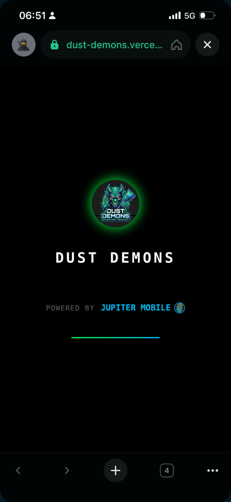
  
  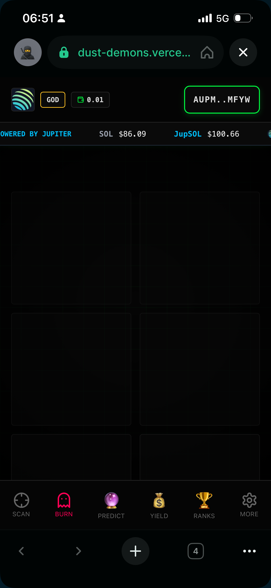
  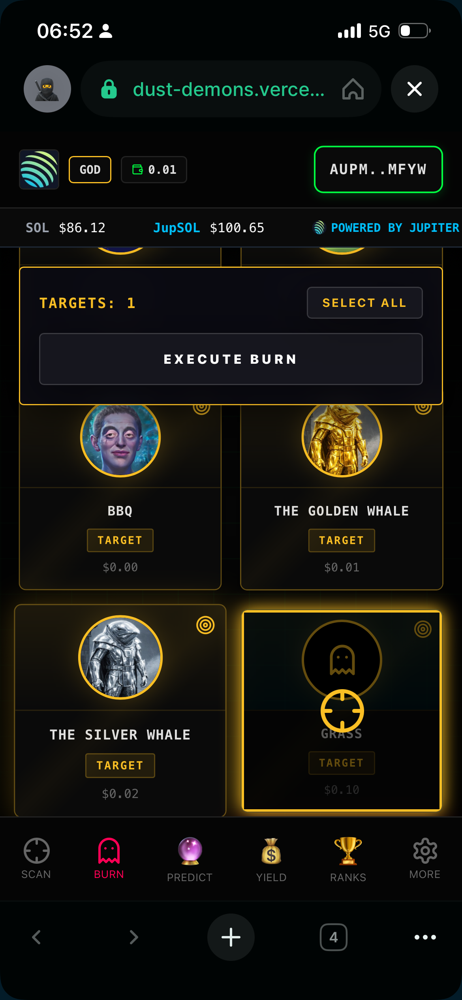
  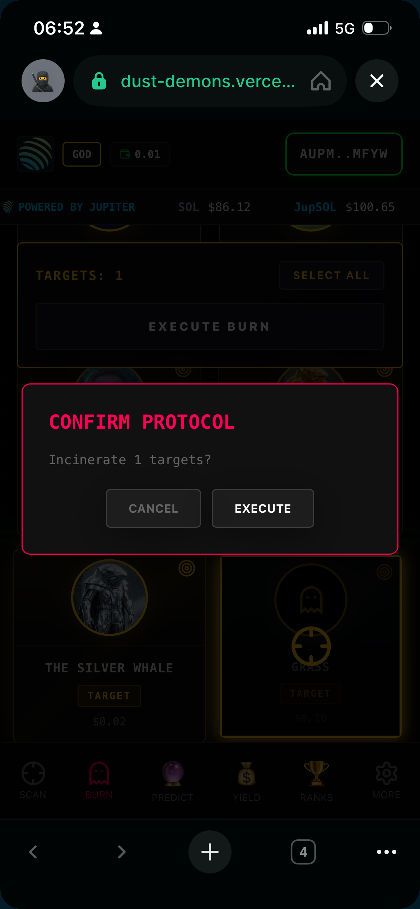
  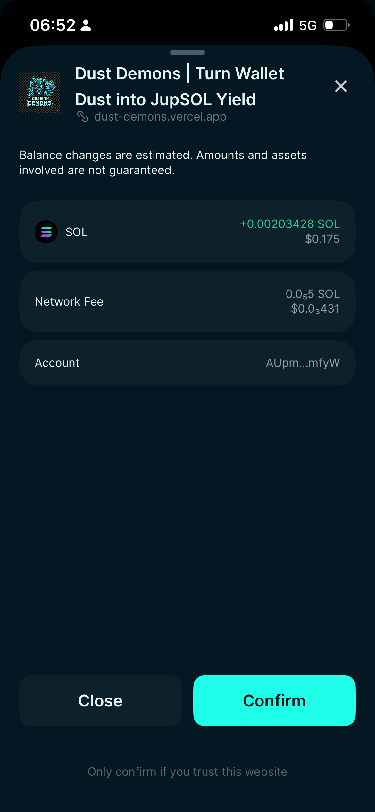
  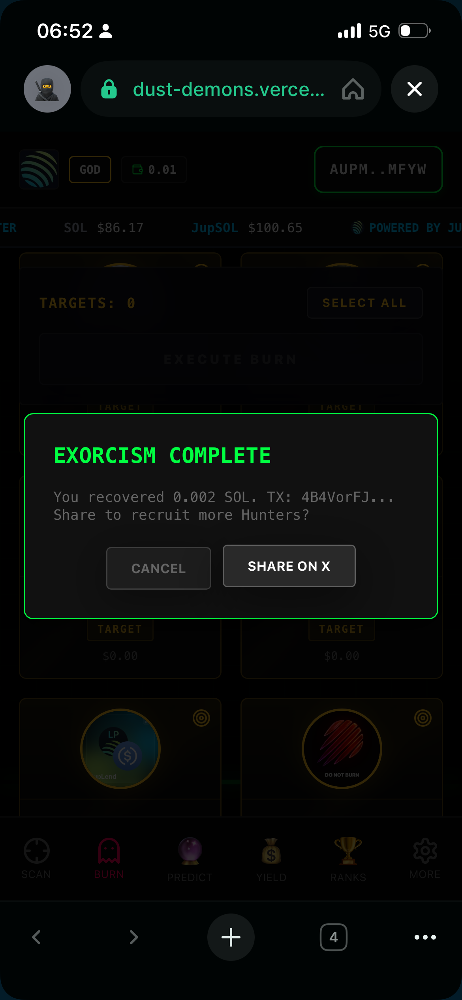
  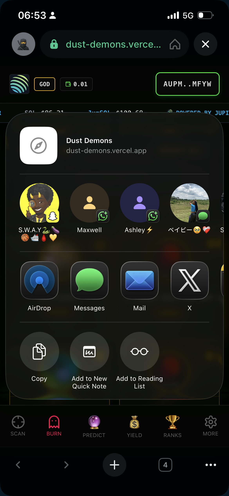
  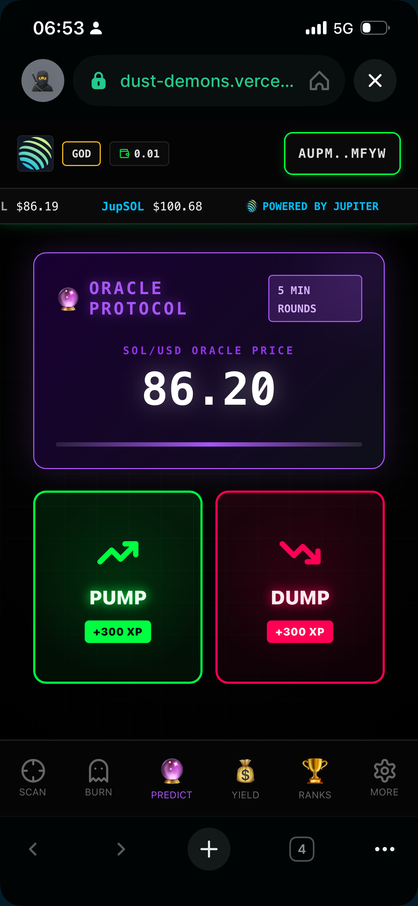
  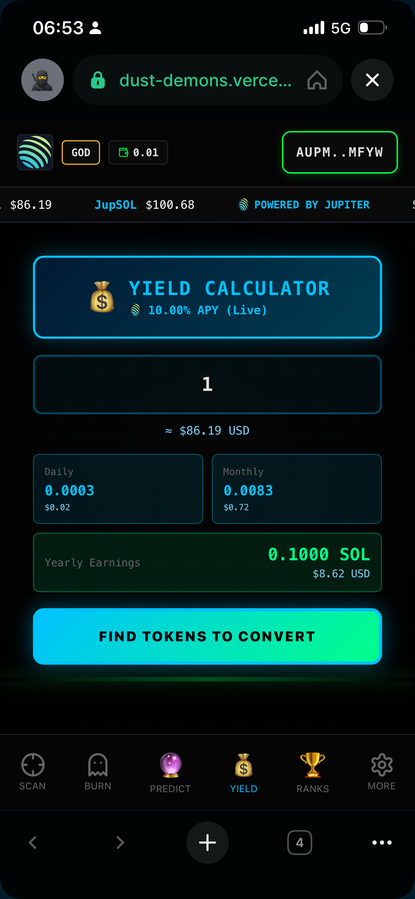
  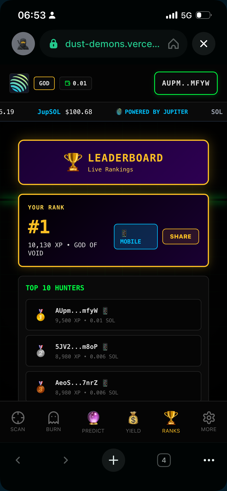
  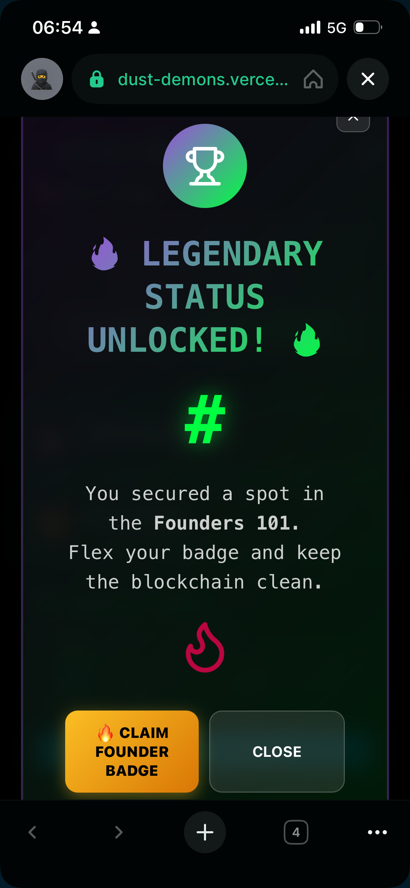
</div>

> **Coming Soon** - Full walkthrough showcasing all features

---

## 🤝 Contributing

This project was built for the Jupiter Hackathon 2026. Contributions, issues, and feature requests are welcome!

1. Fork the repository
2. Create your feature branch (`git checkout -b feature/amazing-feature`)
3. Commit your changes (`git commit -m 'Add amazing feature'`)
4. Push to the branch (`git push origin feature/amazing-feature`)
5. Open a Pull Request

---

## 📝 License

This project is licensed under the MIT License - see the [LICENSE](LICENSE) file for details.

---

## 🙏 Acknowledgments

- **Jupiter** - For the incredible swap infrastructure and mobile SDK
- **Solana** - For the blazing-fast blockchain
- **Helius** - For the enhanced RPC and DAS API
- **Supabase** - For the real-time database
- **Vercel** - For seamless deployment

---

## 📧 Contact

**Developer**: [@southenempire](https://github.com/southenempire)

**Live Demo**: [dust-demons.vercel.app](https://dust-demons.vercel.app)

**Built with** ❤️ **for Jupiter Hackathon 2026**

---

<div align="center">
  
  <p><strong>Powered by Jupiter • Built for Solana</strong></p>
</div>